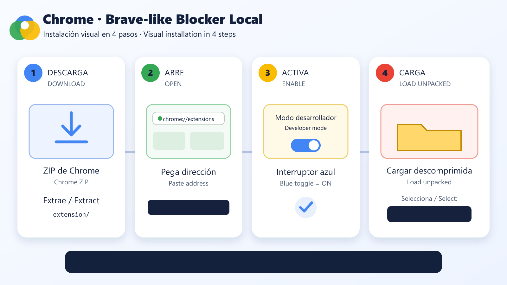
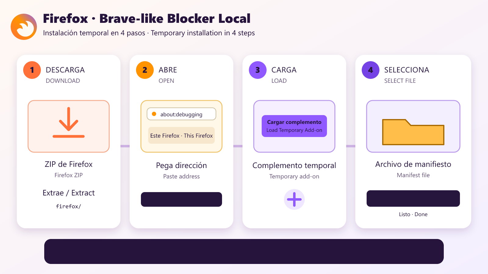

# Brave-like Blocker Local — Chrome + Firefox

[Español](#español) · [English](#english) · [Brave upstream study](docs/BRAVE_UPSTREAM_NOTES.md) · [Releases](https://github.com/eygelias/chrome-brave-blocker-local/releases)

> **Unofficial / No oficial.** Independent WebExtension inspired by Brave Shields. Not affiliated with or endorsed by Brave Software, Google, or Mozilla.

> **Corrección v3.0.1 / v3.0.1 hotfix:** descarta modificadores que DNR no puede representar y rechaza reglas globales peligrosas. v3.0.0 fue retirada porque podía bloquear toda la navegación.

---

# Español

## Qué es

Bloqueador local y silencioso para **Chrome/Chromium Manifest V3** y **Firefox Manifest V3**. Empaqueta reglas DNR generadas desde las listas actuales usadas por Brave, EasyList, EasyPrivacy, uBlock Origin y AdGuard. No tiene cuenta, anuncios propios, telemetría ni descarga código remoto mientras navegas.

No copia 100 % Brave Shields: Brave usa `adblock-rust` dentro del navegador y una extensión está limitada por las API WebExtension. Este proyecto replica únicamente lo que Chrome y Firefox permiten de forma segura.

## Novedades de v3.0.1

- Nueva extensión para **Firefox**.
- Fuentes sincronizadas con el [catálogo oficial de Brave](https://github.com/brave/adblock-resources/blob/b77c5758b9c752b24a1d2184b978ffce1f8f4611/filter_lists/list_catalog.json):
  - filtros predeterminados de anuncios y privacidad;
  - filtros first-party de Brave;
  - EasyList Spanish y AdGuard español/portugués;
  - avisos de cookies y promociones de aplicaciones;
  - URLhaus para dominios maliciosos.
- Conversor DNR moderno con soporte de `$method`, `$urltransform`, `$removeparam` y otros modificadores que DNR puede representar.
- Guardas de seguridad eliminan modificadores no representables —incluidos `$app` y `$referrerpolicy`— y rechazan bloqueos universales DNR sin dominio iniciador o destino.
- CSS cosmético endurecido: rechaza `url()`, `image-set()`, declaraciones inyectables y selectores procedimentales no compatibles.
- Limpieza YouTube reforzada para `player`, Shorts, `fetch`, XHR, `Response.json`, `JSON.parse` y respuestas iniciales.
- Script oficial actual de Brave para retrasos **YouTube SABR**, bajo MPL-2.0, activado solo en `m.youtube.com` como en el despliegue actual de Brave.
- Build auditable: `build-info.json` guarda URL, tamaño y SHA-256 de cada fuente.
- Tutoriales visuales para ambos navegadores.

Detalles y evidencia: [`docs/BRAVE_UPSTREAM_NOTES.md`](docs/BRAVE_UPSTREAM_NOTES.md).

## Funciones

| Función | Chrome | Firefox |
|---|:---:|:---:|
| Bloqueo nativo de red con DNR | ✅ | ✅ |
| EasyList / EasyPrivacy / uBO | ✅ | ✅ |
| Listas Brave compatibles con WebExtension | ✅ | ✅ |
| Filtros español y portugués | ✅ | ✅ |
| Ocultación cosmética genérica | ✅ | ✅ |
| Limpieza experimental de respuestas de YouTube | ✅ | ✅ |
| Corrección móvil YouTube SABR de Brave | ✅ | ✅ |
| Telemetría o recopilación de datos | ❌ | ❌ |
| Interfaz o ventanas emergentes | ❌ | ❌ |

Chrome empaqueta todas las reglas DNR compatibles de la compilación; Firefox queda en **30.000 reglas** por el límite estático actual de Mozilla. Firefox conserva primero excepciones/reglas prioritarias y después una muestra uniforme de reglas de dominio y genéricas. Los conteos y hashes exactos de cada build están en `extension/build-info.json` y `firefox/build-info.json`.

## Instalar en Chrome



1. Abre [Releases](https://github.com/eygelias/chrome-brave-blocker-local/releases).
2. Descarga `chrome-brave-blocker-local-v3.0.1.zip`.
3. Extrae el ZIP en una carpeta permanente. No la borres después.
4. Abre Chrome y escribe:

   ```text
   chrome://extensions/
   ```

5. Activa **Modo de desarrollador** arriba a la derecha.
6. Pulsa **Cargar extensión sin empaquetar**.
7. Selecciona la carpeta extraída:

   ```text
   extension
   ```

8. La extensión queda activa y trabaja en silencio.

### Actualizar Chrome después de una nueva versión

1. Reemplaza el contenido de la carpeta `extension` con la nueva versión.
2. Abre `chrome://extensions/`.
3. Pulsa **Recargar ↻** en la extensión.
4. Cierra y vuelve a abrir las pestañas afectadas.

> Chrome no permite instalar permanentemente un CRX cualquiera descargado desde GitHub como si viniera de Chrome Web Store. Por eso se distribuye ZIP para **Cargar extensión sin empaquetar**.

## Instalar en Firefox

Requiere **Firefox 142 o posterior** para la declaración moderna de no recopilación de datos exigida por Mozilla.



1. Abre [Releases](https://github.com/eygelias/chrome-brave-blocker-local/releases).
2. Descarga `firefox-brave-blocker-local-v3.0.1.zip`.
3. Extrae el ZIP.
4. Abre Firefox y escribe:

   ```text
   about:debugging
   ```

5. Pulsa **Este Firefox**.
6. Pulsa **Cargar complemento temporal…**.
7. Selecciona:

   ```text
   firefox/manifest.json
   ```

8. La extensión queda activa hasta que cierres/reinicies Firefox.

### Limitación de instalación de Firefox

Firefox normal elimina complementos temporales al reiniciar. Para instalación permanente, Mozilla exige un XPI firmado mediante AMO. El release incluye `firefox-brave-blocker-local-v3.0.1-unsigned.xpi` para pruebas, pero **no se presenta como instalación permanente firmada**.

Documentación oficial: [instalación temporal](https://extensionworkshop.com/documentation/develop/temporary-installation-in-firefox/) y [firma/distribución](https://extensionworkshop.com/documentation/publish/signing-and-distribution-overview/).

## Privacidad y seguridad

- Sin telemetría.
- Sin analytics.
- Sin cuentas.
- Sin servidor propio.
- Sin código JavaScript remoto durante navegación.
- Las listas quedan empaquetadas dentro de la extensión.
- Firefox declara `data_collection_permissions.required: ["none"]`.
- Cada build registra hashes SHA-256 de sus fuentes.

## Limitaciones reales

- Chrome y Firefox no pueden copiar la integración nativa `adblock-rust` de Brave.
- DNR no representa todos los filtros procedimentales, scriptlets, redirecciones ni reescrituras de respuesta de Brave/uBO.
- YouTube cambia desde el servidor; ningún bloqueador puede prometer funcionamiento permanente.
- Brave mantiene su corrección SABR solo en YouTube móvil por riesgo de bucles al convivir con uBlock Origin.
- Evita ejecutar simultáneamente este proyecto y otro bloqueador agresivo en YouTube. Dos scripts que modifiquen `fetch` o el reproductor pueden interferirse.
- Firefox se limita automáticamente a 30.000 reglas según [`ExtensionDNRLimits.sys.mjs`](https://github.com/mozilla-firefox/firefox/blob/main/toolkit/components/extensions/ExtensionDNRLimits.sys.mjs). Chrome conserva todas las reglas compatibles, pero su capacidad adicional forma parte de un límite global compartido; si Chrome informa falta de capacidad, desactiva otros bloqueadores con grandes rulesets.

## Compilar y verificar

Requiere Node.js 22+ y Python 3.11+:

```bash
npm install
npm run build
npm test
npm run package
```

Resultados:

```text
extension/   Extensión Chrome lista para cargar
firefox/     Extensión Firefox lista para carga temporal

dist/chrome-brave-blocker-local-v3.0.1.zip
dist/firefox-brave-blocker-local-v3.0.1.zip
dist/firefox-brave-blocker-local-v3.0.1-unsigned.xpi
```

## Licencias

Código propio: GPL-3.0-only. El script SABR y listas de Brave conservan MPL-2.0. Las listas generadas mantienen sus licencias originales. Consulta [`THIRD_PARTY_NOTICES.md`](THIRD_PARTY_NOTICES.md).

---

# English

## What it is

Silent local ad and tracker blocker for **Chrome/Chromium Manifest V3** and **Firefox Manifest V3**. It bundles DNR rules generated from current Brave, EasyList, EasyPrivacy, uBlock Origin, and AdGuard sources. No account, built-in advertising, telemetry, or runtime remote code.

It does not copy Brave Shields one-for-one: Brave runs `adblock-rust` inside the browser, while extensions are constrained by WebExtension APIs. This project only reproduces behavior Chrome and Firefox can safely expose.

## What changed in v3.0.1

- Added a **Firefox** build.
- Aligned sources with Brave's [official filter catalog](https://github.com/brave/adblock-resources/blob/b77c5758b9c752b24a1d2184b978ffce1f8f4611/filter_lists/list_catalog.json).
- Added Brave first-party, Spanish/Portuguese, cookie-notice, mobile-promotion, and URLhaus sources.
- Modern DNR conversion for `$method`, `$urltransform`, `$removeparam`, and other expressible modifiers.
- Conversion safety guards drop unrepresentable modifiers—including `$app` and `$referrerpolicy`—and reject unscoped universal DNR blocks.
- Brave-inspired cosmetic CSS hardening against `url()`, `image-set()`, injectable declarations, and unsupported procedural selectors.
- Hardened YouTube response pruning for player endpoints, Shorts, `fetch`, XHR, `Response.json`, `JSON.parse`, and initial player data.
- Vendored Brave's current MPL-2.0 YouTube SABR backoff fix, enabled only on `m.youtube.com`, matching Brave's cautious rollout.
- Auditable `build-info.json` source URLs, byte counts, and SHA-256 hashes.
- Bilingual visual installation guides.

Evidence and technical mapping: [`docs/BRAVE_UPSTREAM_NOTES.md`](docs/BRAVE_UPSTREAM_NOTES.md).

Chrome bundles every compatible DNR rule produced by the build; Firefox is capped at **30,000 rules** by Mozilla's current static limit. Firefox retains exceptions/high-priority rules first, followed by an even sample of domain and generic block rules. Exact build counts and hashes live in `extension/build-info.json` and `firefox/build-info.json`.

## Install on Chrome


1. Open [Releases](https://github.com/eygelias/chrome-brave-blocker-local/releases).
2. Download `chrome-brave-blocker-local-v3.0.1.zip`.
3. Extract it to a permanent folder.
4. Open:

   ```text
   chrome://extensions/
   ```

5. Enable **Developer mode**.
6. Click **Load unpacked**.
7. Select the extracted folder:

   ```text
   extension
   ```

8. The blocker now runs silently.

### Updating Chrome

Replace the old `extension` folder contents, open `chrome://extensions/`, click **Reload ↻**, then reopen affected tabs.

## Install on Firefox

Requires **Firefox 142 or later** for Mozilla's current no-data-collection manifest declaration.


1. Open [Releases](https://github.com/eygelias/chrome-brave-blocker-local/releases).
2. Download `firefox-brave-blocker-local-v3.0.1.zip`.
3. Extract it.
4. Open:

   ```text
   about:debugging
   ```

5. Click **This Firefox**.
6. Click **Load Temporary Add-on…**.
7. Select:

   ```text
   firefox/manifest.json
   ```

8. The blocker remains installed until Firefox restarts.

Standard Firefox requires Mozilla signing for permanent installation. The release's `-unsigned.xpi` is a test artifact, not a permanently installable signed add-on.

## Privacy

- No telemetry or analytics.
- No accounts or project server.
- No runtime remote JavaScript.
- Filter rules are bundled locally.
- Firefox declares no data collection.
- Every build records source SHA-256 hashes.

## Real limitations

- WebExtensions cannot reproduce Brave's browser-native `adblock-rust` integration.
- DNR cannot express every procedural filter, scriptlet, redirect resource, or response rewrite.
- YouTube behavior changes server-side; permanent blocking cannot be guaranteed.
- Avoid running multiple aggressive YouTube blockers together because competing `fetch`/player hooks can conflict.
- Firefox is automatically capped at 30,000 rules per [`ExtensionDNRLimits.sys.mjs`](https://github.com/mozilla-firefox/firefox/blob/main/toolkit/components/extensions/ExtensionDNRLimits.sys.mjs). Chrome keeps every compatible rule, but extra capacity belongs to a shared global pool; disable other large blockers if Chrome reports insufficient capacity.

## Build and validate

```bash
npm install
npm run build
npm test
npm run package
```

Project-authored code is GPL-3.0-only. Brave material remains MPL-2.0. Generated filter artifacts retain upstream terms. See [`THIRD_PARTY_NOTICES.md`](THIRD_PARTY_NOTICES.md).
